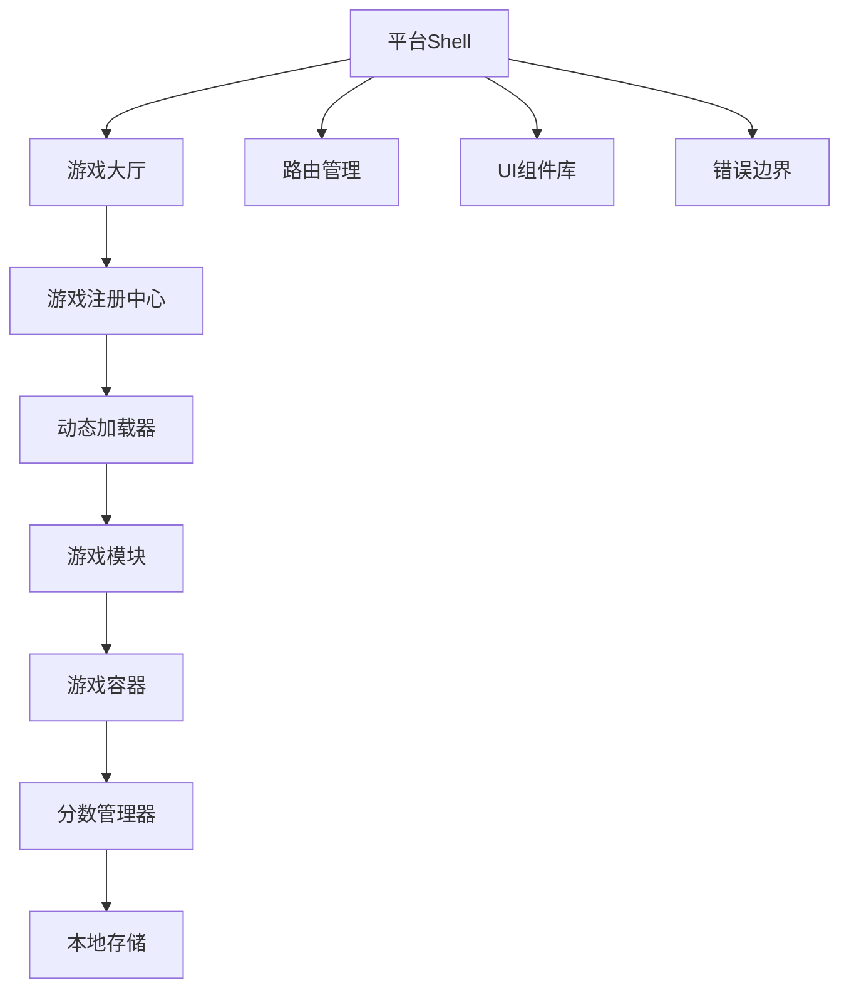

# 设计文档

## 概述

网页游戏平台采用模块化架构，将平台核心功能与游戏实现完全分离。平台提供统一的游戏管理、路由、UI框架和分数存储，而每个游戏作为独立模块通过标准接口集成。这种设计确保了高度的可扩展性和可维护性。

## 架构

### 整体架构



### 分层架构

1. **平台层 (Platform Layer)**
   - Next.js App Router 路由管理
   - 全局状态管理
   - 通用UI组件
   - 错误处理和边界

2. **游戏管理层 (Game Management Layer)**
   - 游戏注册中心
   - 动态加载器
   - 生命周期管理
   - 分数管理

3. **游戏实现层 (Game Implementation Layer)**
   - 独立游戏模块
   - 游戏状态管理
   - 渲染引擎
   - 输入处理

## 组件和接口

### 核心接口定义

```typescript
// 游戏模块统一接口
export interface GameModule {
  id: string;                    // 游戏唯一标识符
  name: string;                  // 游戏显示名称
  description?: string;          // 游戏描述
  mount(container: HTMLElement): void;    // 挂载游戏到容器
  unmount(): void;              // 卸载游戏并清理资源
}

// 游戏元数据
export interface GameMetadata {
  id: string;
  name: string;
  description: string;
  thumbnail?: string;           // 游戏缩略图
  category: string;             // 游戏分类
  difficulty: 'easy' | 'medium' | 'hard';
  controls: ('keyboard' | 'mouse' | 'touch')[];
}

// 分数接口
export interface GameScore {
  gameId: string;
  score: number;
  timestamp: number;
  metadata?: Record<string, any>;  // 游戏特定的额外数据
}

// 游戏注册中心接口
export interface GameRegistry {
  register(gameId: string, loader: () => Promise<GameModule>): void;
  unregister(gameId: string): void;
  getGame(gameId: string): Promise<GameModule>;
  getAllGames(): GameMetadata[];
  isRegistered(gameId: string): boolean;
}
```

### 平台核心组件

#### 1. 游戏注册中心 (GameRegistry)

```typescript
class GameRegistryImpl implements GameRegistry {
  private games = new Map<string, () => Promise<GameModule>>();
  private metadata = new Map<string, GameMetadata>();
  private loadedGames = new Map<string, GameModule>();

  // 注册游戏模块
  register(gameId: string, loader: () => Promise<GameModule>, metadata: GameMetadata): void;
  
  // 动态加载游戏
  async getGame(gameId: string): Promise<GameModule>;
  
  // 获取所有游戏元数据
  getAllGames(): GameMetadata[];
}
```

#### 2. 分数管理器 (ScoreManager)

```typescript
class ScoreManager {
  private storageKey = 'game-platform-scores';

  // 保存分数
  saveScore(gameId: string, score: number, metadata?: Record<string, any>): void;
  
  // 获取最高分
  getHighScore(gameId: string): GameScore | null;
  
  // 获取所有分数记录
  getAllScores(gameId: string): GameScore[];
  
  // 清除游戏分数
  clearScores(gameId: string): void;
}
```

#### 3. 游戏容器管理器 (GameContainer)

```typescript
class GameContainer {
  private container: HTMLElement;
  private currentGame: GameModule | null = null;

  // 挂载游戏
  async mountGame(gameId: string): Promise<void>;
  
  // 卸载当前游戏
  unmountCurrentGame(): void;
  
  // 获取容器元素
  getContainer(): HTMLElement;
}
```

### 游戏模块实现模式

每个游戏遵循以下结构：

```
src/games/[game-name]/
├── index.ts          // 游戏模块入口
├── game.ts           // 游戏核心逻辑
├── renderer.ts       // 渲染引擎
├── input.ts          // 输入处理
├── state.ts          // 状态管理
└── types.ts          // 类型定义
```

#### 游戏模块示例结构

```typescript
// src/games/minesweeper/index.ts
export class MinesweeperGame implements GameModule {
  id = 'minesweeper';
  name = '扫雷';
  description = '经典扫雷游戏';

  private gameEngine: MinesweeperEngine;
  private renderer: MinesweeperRenderer;
  private inputHandler: InputHandler;

  mount(container: HTMLElement): void {
    // 初始化游戏引擎
    this.gameEngine = new MinesweeperEngine();
    this.renderer = new MinesweeperRenderer(container);
    this.inputHandler = new InputHandler(container);
    
    // 绑定事件
    this.setupEventListeners();
    
    // 开始游戏循环
    this.startGameLoop();
  }

  unmount(): void {
    // 清理资源
    this.inputHandler?.destroy();
    this.renderer?.destroy();
    this.gameEngine?.destroy();
  }
}
```

## 数据模型

### 游戏状态模型

```typescript
// 通用游戏状态
interface BaseGameState {
  status: 'idle' | 'playing' | 'paused' | 'finished';
  score: number;
  startTime: number;
  endTime?: number;
}

// 扫雷游戏状态
interface MinesweeperState extends BaseGameState {
  board: Cell[][];
  mineCount: number;
  flagCount: number;
  difficulty: 'beginner' | 'intermediate' | 'expert';
}

// 2048游戏状态
interface Game2048State extends BaseGameState {
  board: number[][];
  bestScore: number;
  canUndo: boolean;
}

// 俄罗斯方块游戏状态
interface TetrisState extends BaseGameState {
  board: number[][];
  currentPiece: TetrisPiece;
  nextPiece: TetrisPiece;
  level: number;
  lines: number;
}
```

### 本地存储数据结构

```typescript
interface StorageData {
  scores: {
    [gameId: string]: GameScore[];
  };
  settings: {
    theme: 'light' | 'dark';
    soundEnabled: boolean;
    language: 'zh' | 'en';
  };
  gameStates: {
    [gameId: string]: any;  // 游戏特定的保存状态
  };
}
```

## 正确性属性

*属性是一个特征或行为，应该在系统的所有有效执行中保持为真——本质上是关于系统应该做什么的正式声明。属性作为人类可读规范和机器可验证正确性保证之间的桥梁。*

基于需求分析，以下是关键的正确性属性：

### 属性 1: 游戏模块接口合规性
*对于任何* 注册到游戏注册中心的游戏模块，该模块必须实现完整的GameModule接口，包含id、name、mount和unmount方法
**验证需求: 需求 1.3, 2.1**

### 属性 2: 游戏隔离性和资源清理
*对于任何* 游戏模块，当它被卸载时，必须完全清理所有资源、事件监听器和DOM元素，不影响平台或其他游戏的状态
**验证需求: 需求 1.5, 2.3, 2.4, 9.5**

### 属性 3: 游戏生命周期管理
*对于任何* 游戏选择和切换操作，平台必须正确执行当前游戏的卸载和新游戏的挂载，确保容器状态的一致性
**验证需求: 需求 2.2, 3.2, 3.3**

### 属性 4: 分数持久化一致性
*对于任何* 游戏和分数，当分数被保存时，它必须能够在后续会话中被正确检索，且不同游戏的分数必须保持隔离
**验证需求: 需求 4.5, 6.1, 6.2, 6.4, 6.5**

### 属性 5: 分数跟踪准确性
*对于任何* 正在进行的游戏，平台必须准确跟踪和显示当前分数，并在游戏结束时正确更新最高分记录
**验证需求: 需求 4.4, 6.3**

### 属性 6: 响应式布局适配性
*对于任何* 屏幕尺寸（包括最小320px宽度），平台和所有游戏必须提供可用的布局和适当的控制方式
**验证需求: 需求 5.1, 5.2, 5.3, 5.5**

### 属性 7: 导航状态一致性
*对于任何* 游戏和大厅之间的导航操作，平台必须保持一致的导航状态并在切换期间显示适当的加载指示器
**验证需求: 需求 3.4, 3.5, 9.2**

### 属性 8: 错误隔离性
*对于任何* 游戏中发生的错误或崩溃，平台的核心功能必须保持稳定，用户仍能返回游戏大厅或切换到其他游戏
**验证需求: 需求 8.5**

<function_calls>
<invoke name="prework">
<parameter name="featureName">web-game-platform

## 错误处理

### 错误边界策略

1. **游戏级错误边界**
   - 每个游戏容器包装在React错误边界中
   - 游戏崩溃时显示友好的错误信息
   - 提供重新加载游戏的选项

2. **平台级错误处理**
   - 全局错误边界捕获未处理的错误
   - 网络错误的重试机制
   - 本地存储错误的降级处理

3. **资源加载错误**
   - 游戏模块加载失败的回退机制
   - 图片和资源加载错误处理
   - 超时处理和用户反馈

### 错误恢复机制

```typescript
interface ErrorRecovery {
  // 游戏错误恢复
  recoverFromGameError(gameId: string): Promise<void>;
  
  // 存储错误恢复
  recoverFromStorageError(): void;
  
  // 网络错误重试
  retryFailedOperation(operation: () => Promise<any>, maxRetries: number): Promise<any>;
}
```

## 测试策略

### 双重测试方法

我们将采用单元测试和基于属性的测试相结合的方法：

- **单元测试**: 验证特定示例、边缘情况和错误条件
- **属性测试**: 验证所有输入的通用属性
- 两者互补，提供全面覆盖

### 单元测试重点

单元测试专注于：
- 特定示例，展示正确行为
- 组件间的集成点
- 边缘情况和错误条件

属性测试专注于：
- 对所有输入都成立的通用属性
- 通过随机化实现全面的输入覆盖

### 基于属性的测试配置

- **测试库**: 使用 `fast-check` 进行基于属性的测试
- **最小迭代次数**: 每个属性测试至少100次迭代（由于随机化）
- **测试标记**: 每个属性测试必须引用其设计文档属性
- **标记格式**: **Feature: web-game-platform, Property {number}: {property_text}**
- **实现要求**: 每个正确性属性必须由单个基于属性的测试实现

### 测试覆盖范围

1. **游戏模块测试**
   - 接口合规性测试
   - 生命周期管理测试
   - 资源清理测试

2. **平台核心测试**
   - 游戏注册和加载测试
   - 分数管理测试
   - 导航和路由测试

3. **集成测试**
   - 端到端游戏流程测试
   - 跨浏览器兼容性测试
   - 响应式设计测试

4. **性能测试**
   - 内存泄漏检测
   - 加载时间测试
   - 帧率性能测试

### 测试环境配置

```typescript
// 测试配置示例
describe('Game Platform Properties', () => {
  it('Property 1: Game module interface compliance', () => {
    fc.assert(fc.property(
      fc.record({
        id: fc.string(),
        name: fc.string(),
        description: fc.option(fc.string())
      }),
      (gameData) => {
        // 测试游戏模块接口合规性
        const game = createMockGame(gameData);
        expect(game).toHaveProperty('id');
        expect(game).toHaveProperty('name');
        expect(game).toHaveProperty('mount');
        expect(game).toHaveProperty('unmount');
      }
    ), { numRuns: 100 });
  });
});
```

这种测试策略确保了平台的可靠性和正确性，同时为未来的功能扩展提供了坚实的测试基础。